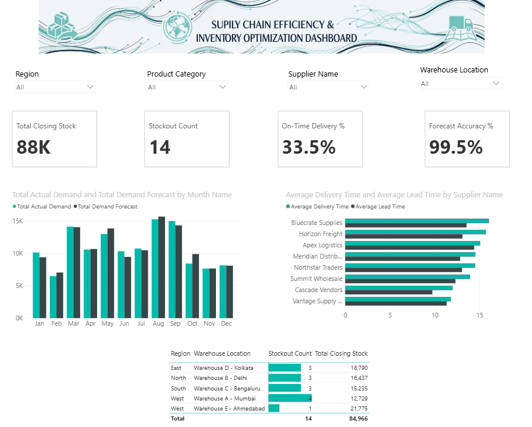

# 📦 Supply Chain Efficiency & Inventory Optimization Dashboard

> **Author / Created By:** ELAVARASAN R

---



---

## 📌 Project Overview

A Power BI dashboard that monitors inventory levels, delivery performance, and demand forecast accuracy across products, suppliers, and warehouses — built to mirror how a supply chain analyst, inventory planner, or operations team keeps stock, cost, and service levels under control.

---

## 🎯 Objective

Build an interactive Power BI dashboard to monitor supply chain KPIs (inventory turnover, stockouts, on-time delivery, lead time, forecast accuracy) and identify optimization opportunities per SKU. Specifically, to answer:
1. Which products are at risk of stockout, and which already have?
2. Which suppliers are reliably on time, and which are dragging down delivery performance?
3. Is actual demand tracking the forecast, or are we consistently over/under-forecasting?
4. Which categories and warehouses turn inventory efficiently vs. sit on excess stock?

---

## 🏭 Industry Relevance

Manufacturing, retail, and e-commerce teams rely on near-real-time visibility into inventory, demand, and fulfillment to lower working capital, prevent stockouts, and improve service levels. This project gives an interview-ready, end-to-end supply chain analytics solution built entirely in tools already on a business analyst's desk.

---

## 🛠️ Tools Used

- **Power BI Desktop** — Data modeling, DAX, dashboard build
- **Power Query** — Data cleaning and ETL transformations
- **Microsoft Excel** — Source dataset
- **DAX (Data Analysis Expressions)** — Key Performance Indicators (KPIs) and measure logic
- **GitHub** — Version control, documentation, and portfolio hosting

---

## 📊 Dataset Description

`Supply_Chain_Dataset.xlsx` contains 150 transaction-level rows (Jan 2024 – Dec 2025) with 26 columns:

| Column | Description |
|---|---|
| Date | Transaction/record date |
| Month | Month name, derived from Date |
| Quarter | Q1–Q4, derived from Date |
| Year | Calendar year |
| Product ID | SKU identifier |
| Product Name | Specific product |
| Product Category | Electronics, Home Appliances, Furniture, Apparel, FMCG |
| Supplier Name | Supplier fulfilling this order |
| Warehouse Location | Warehouse holding the stock |
| Region | Region the warehouse serves |
| Opening Stock | Stock on hand at period start |
| Incoming Stock | Stock received during the period |
| Units Sold | Units sold/shipped out during the period |
| Closing Stock | Opening Stock + Incoming Stock − Units Sold |
| Reorder Level | Stock threshold that should trigger a reorder |
| Reorder Status | "Reorder Needed" if Closing Stock ≤ Reorder Level, else "Sufficient" |
| Lead Time (Days) | Supplier's quoted lead time |
| Order Quantity | Quantity ordered from the supplier |
| Delivery Status | "Delayed" if Delivery Time > Lead Time, else "On Time" |
| Delivery Time (Days) | Actual days taken for delivery |
| Inventory Holding Cost | Cost of holding this stock for the period |
| Stockout Status | "Yes" if Closing Stock ≤ 0, else "No" |
| Demand Forecast | Forecasted demand for the period |
| Actual Demand | Demand that actually materialized |
| Forecast Accuracy % | 1 − ABS(Forecast − Actual) ÷ Actual |
| Inventory Turnover Ratio | Units Sold ÷ Average Inventory (Opening + Closing) ÷ 2 |

`Closing Stock`, `Reorder Status`, `Delivery Status`, `Stockout Status`, `Forecast Accuracy %`, and `Inventory Turnover Ratio` are all live Excel formulas, not hardcoded.

A second file, `Raw_Dataset_Before_Cleaning.xlsx`, contains the same raw data before cleanup — deliberately containing null values, inconsistent text casing, extra whitespace, and duplicate rows for Power Query ETL processing.

---

## 🔄 Power Query Steps

See [`docs/POWER_QUERY_STEPS.md`](docs/POWER_QUERY_STEPS.md) for the full click-by-click walkthrough. 
- Removed nulls and handled blank entries.
- Standardized text capitalization and trimmed extra whitespace.
- Converted date serial formats using locale configurations.
- Standardized numeric fields and percentage data types.

---

## 🧮 DAX Measures & Calculations

See [`docs/DAX_MEASURES.md`](docs/DAX_MEASURES.md) for every measure with its formula and plain-language explanation. Includes:
- **Total Closing Stock:** `SUM(Raw_Data[Closing Stock])`
- **Stockout Count:** `SUM(Raw_Data[Is Stockout]) + 0`
- **On-Time Delivery %:** Contractually compliant order deliveries evaluated against lead times.
- **Forecast Accuracy %:** Deviation assessment between demand projections and actual realized demand.

---

## 🖥️ Dashboard Features & Architecture

- **Global Slicer Control Bar:** Instant filtering across `Region`, `Product Category`, `Supplier Name`, and `Warehouse Location`.
- **Top KPI Cards:** Instant callouts for `Total Closing Stock`, `Stockout Count`, `On-Time Delivery %`, and `Forecast Accuracy %`.
- **Demand Forecast vs. Actual Demand:** Clustered column chart tracking monthly volume variances.
- **Supplier Delivery SLA Performance:** Clustered bar chart comparing average supplier lead times against actual delivery timelines.
- **Regional Stockout Risk Matrix:** Detailed table breakdown enriched with conditional formatting data bars to highlight high-risk distribution hubs.

---

## 📁 Repository Structure

```text
supply-chain-inventory-optimization-dashboard/
├── README.md
├── Supply_Chain_Dataset.xlsx
├── Raw_Dataset_Before_Cleaning.xlsx
├── Supply-Chain-Efficiency-Inventory-Optimization-Dashboard.pbix
├── docs/
│   ├── POWER_QUERY_STEPS.md
│   ├── DAX_MEASURES.md
│   ├── REPORT_BUILD_GUIDE.md
│   ├── PROJECT_OVERVIEW.md
│   ├── RESUME_DESCRIPTIONS.md
│   ├── LINKEDIN_CONTENT.md
│   └── PROJECT_CHECKLIST.md
└── screenshots/
    └── supplychain_dashboard1.png
